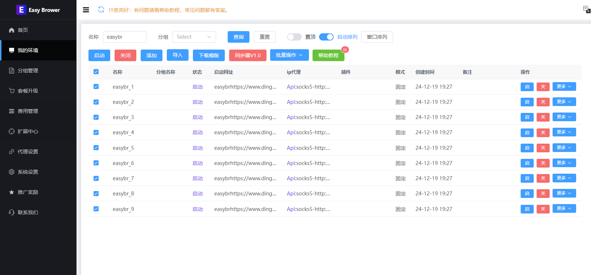
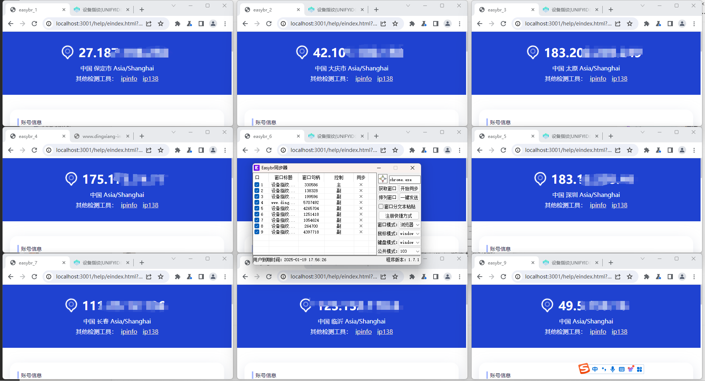
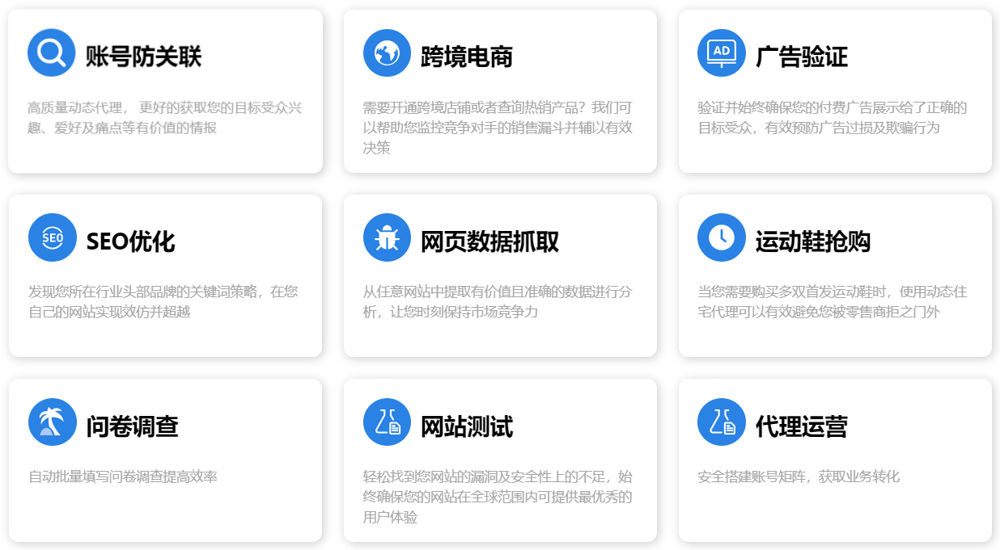
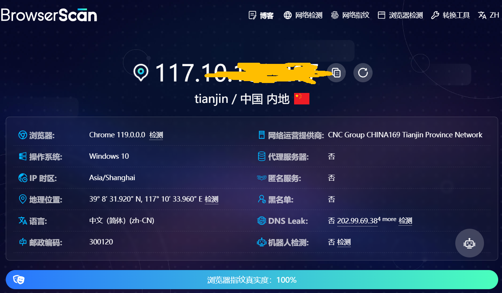
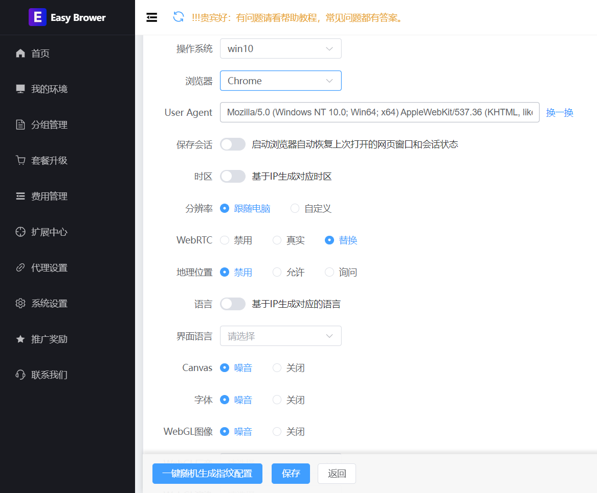

# easybr 永久免费指纹浏览器
## EasyBr - 极简指纹浏览器介绍

官网：https://www.ebrower.com/
帮助教程：https://ebrower.com/helperdoc/easybrintroduce.html

### EasyBr：一款简单好用的指纹浏览器

#### 我们的口号：

价格最便宜！使用最简单！功能最强大！

### 简介

EasyBr 是一款功能强大的指纹浏览器，专注于为用户提供隐私保护和高效工作支持。其特色功能包括账号管理、自定义指纹、多开浏览器等，适合个人用户和企业团队使用。

### 核心功能

#### 1. 账号管理

- 支持批量导入、导出和任务创建。
- 提供灵活的分组管理和高效的账号切换功能。

#### 2. 浏览器指纹管理

- 硬件级指纹修改，支持多平台检测。
- 自定义时区、语言、User-Agent、字体、分辨率等信息。
- 每个浏览器实例均具备独立指纹设置，确保多开环境下的隐私保护。

#### 3. 多开浏览器

- 支持多个独立浏览器环境，方便同时登录多个账号或处理多任务。

#### 4. 自动化操作

- 内置自动化工具，可执行表单填写、数据抓取等重复性任务。
- 提升效率，解放人力资源。

#### 5. 团队协作

- 支持多用户协作，可按分组管理账号并分配权限。
- 功能权限灵活分配，满足不同角色需求。

#### 6. 主流代理支持

- 内置代理支持，帮助用户访问特定地区网站或绕过限制。支持http，https，socks5 以及需要账号密码授权代理

#### 7. 浏览器插件支持

- 兼容主流插件，如油猴、翻译、Adblock Plus 等。
- 实现个性化定制，提升功能扩展性。

#### 8. Cookie 管理

- 支持单个及批量导入、导出 Cookie，自动完成登录。
- 所有 Cookie 保存在本地，杜绝泄露风险。

#### 9. 群控同步器

- 支持多台设备同步操作，包括鼠标键盘、标签页管理、一键打码等。

#### 10. RPA 对接

- 完美支持主流 RPA 系统对接，扩展自动化操作能力。

### EasyBr 的优势

#### 1. 价格优势

- EasyBr 的价格仅为同行产品的十分之一，且提供永久免费版本！

#### 2. 功能全面

- 集账号管理、浏览器指纹、多开、自动化操作、团队协作于一体。

#### 3. 操作简单

- 界面简洁直观，新手也能快速上手。

#### 4. 快速迭代

- 每周两次更新，持续优化用户体验。

#### 5. 免费延期服务

- 遇到技术问题时，支持免费延期使用，保障用户体验。

#### 6. 大量 User-Agent 库

- 拥有数千万条 User-Agent 数据，支持个性化指纹模拟。

#### 7. 信息安全

- 数据仅保存在本地，任何第三方无法访问。cookie 和用户环境信息，均不上传服务器，这个为了保障用户数据安全与其他浏览器不一样的功能。

### 使用场景

账号防关联，跨境电商，广告验证，SEO优化，网页数据抓取，运动鞋抢购，问卷调查，网站测试，代理运营等

### 浏览器指纹优化与修改指南

通过 [FingerprintJS](https://fingerprintjs.github.io/fingerprintjs/) 和 [BrowserLeaks](https://browserleaks.com/) 测试指纹修改效果。

#### 核心优化项

1. **操作系统**：修改 `userAgent` 中的操作系统标识。
2. **浏览器版本**：调整 `userAgent` 的浏览器版本号。
3. **语言**：自定义 `navigator.language`，支持多语言伪装。
4. **时区**：动态匹配 IP 时区或手动设置。
5. **分辨率**：伪装 `screen.width` 和 `screen.height`。
6. **地理位置**：调整 `navigator.geolocation` 返回的经纬度。

#### 高级优化项

1. **Canvas 和 WebGL**：

   - 随机修改差分像素数据，避免通过图像指纹追踪。
   - 自定义 WebGL 厂商和渲染器信息。

2. **AudioContext**：随机化音频频谱数据。

3. **硬件信息**：调整 CPU 核心数、内存大小、设备名称等。

4. **代理设置**：支持自定义或自动提取代理。

   

### 联系我们

更多帮助和教程，请访问官网或联系客服。

微信：haohaoxuexibbb

邮箱：370900938@qq.com

